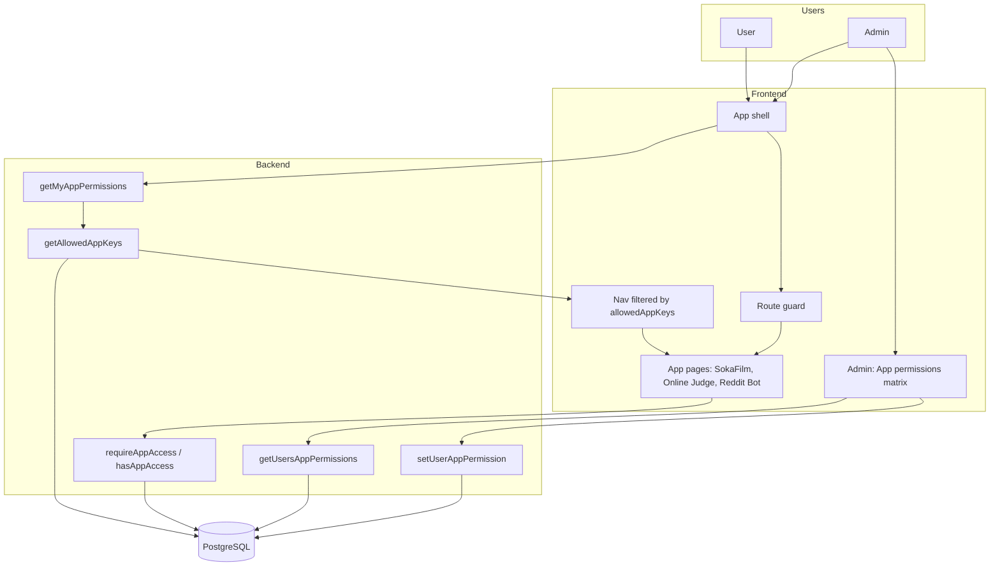
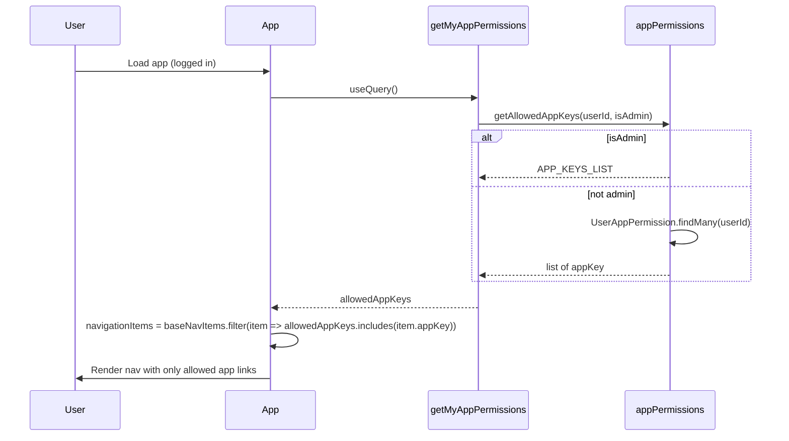
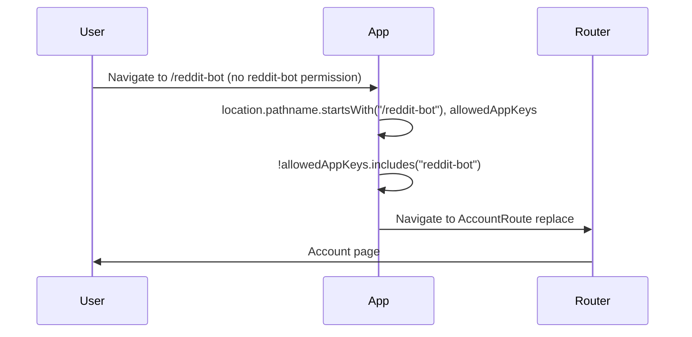
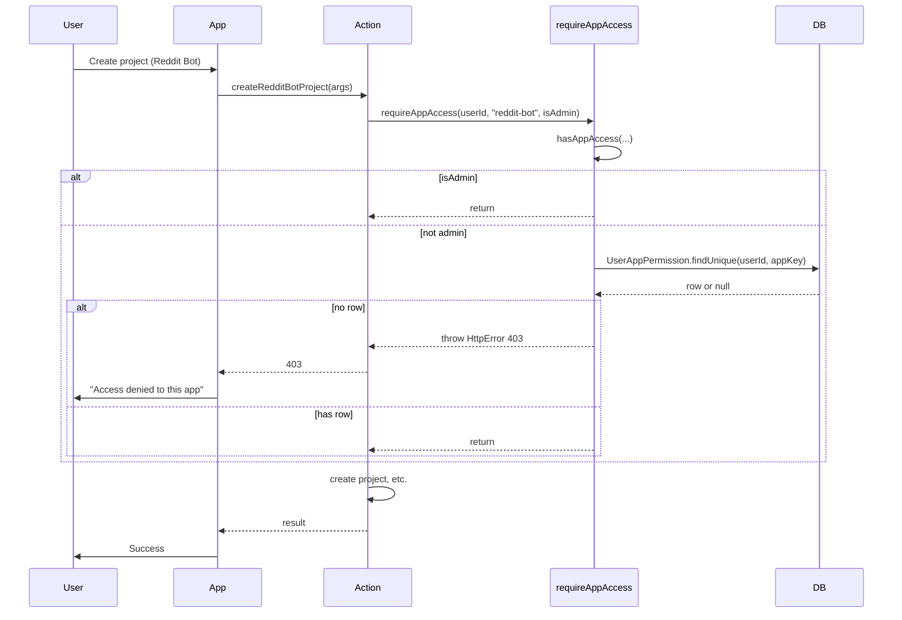

# App-specific permissions — Full documentation

The toolkit gates access to each **app** (SokaFilm, Online Judge, Reddit Bot) by a per-user, per-app permission matrix. There is **no global middleware**: every app-specific action and query must explicitly call `requireAppAccess`. Admins bypass all checks and see all apps. Non-admins only see and use apps for which they have a `UserAppPermission` row.

---

## 1. Overview

- **Purpose:** Control which users can use which apps. Apps are identified by an `AppKey` (e.g. `sokafilm`, `online-judge`, `reddit-bot`). Access is granted or revoked by admins; no default grant for new users (unless a backfill or migration adds it).
- **Enforcement:** Backend: each app operation calls `requireAppAccess(userId, appKey, isAdmin)` at the start; missing permission → 403. Frontend: nav shows only allowed apps; direct URL to an app without permission redirects to Account.

### 1.1 System overview



- **Frontend:** App shell loads `getMyAppPermissions` → `getAllowedAppKeys` (admins get all keys; others from `UserAppPermission`). Nav shows only allowed app links; route guard redirects to Account when opening an app URL without permission. Each app’s actions/queries call `requireAppAccess` before doing work.
- **Backend:** `getAllowedAppKeys` and `hasAppAccess` read from DB (or bypass for admin). `requireAppAccess` throws 403 when access is missing. Admin operations `getUsersAppPermissions` and `setUserAppPermission` read/update the permission matrix.
- **Data:** `User` and `UserAppPermission` (userId, appKey) store who can access which app.

---

## 2. Concepts

- **AppKey** — Enum-like set of app identifiers in [appKeys.ts](../src/shared/appKeys.ts): `sokafilm`, `online-judge`, `reddit-bot`. Used in `UserAppPermission`, nav items, and permission checks. Must stay in sync with nav and backend gating.
- **UserAppPermission** — One row per (userId, appKey) means the user is allowed that app. Stored in DB; admins grant/revoke via the admin matrix.
- **requireAppAccess(userId, appKey, isAdmin)** — Throws `HttpError(403)` if the user does not have access. Call at the start of every app-specific action/query (and in custom APIs like file serve).
- **hasAppAccess(userId, appKey, isAdmin)** — Returns `true`/`false`. Use when you need a boolean (e.g. custom logic: “allow if file owner or has app access”).
- **getAllowedAppKeys(userId, isAdmin)** — Returns the list of app keys the user may access. Admins get `APP_KEYS_LIST`; others get keys from `UserAppPermission` rows.
- **Admin bypass** — If `isAdmin` is true, `hasAppAccess` and `getAllowedAppKeys` treat the user as having all apps; no DB lookup for admins.

---

## 3. Features

- **Nav filtering** — Logged-in user’s nav items are filtered by `getMyAppPermissions` (allowed app keys). Logged-out users see no app links.
- **Route guard** — If a user opens an app route (e.g. `/sokafilm`, `/online-judge`, `/reddit-bot`) without that app in `allowedAppKeys`, the app redirects to Account.
- **Backend gating** — Every SokaFilm, Online Judge, and Reddit Bot action/query calls `requireAppAccess` with the appropriate `AppKey`; 403 if not allowed.
- **Custom APIs** — Other entry points (e.g. `serveFile` in serverSetup) use `hasAppAccess` when access depends on app permission.
- **Admin UI** — App permissions page: user list (paginated, filter by email) × app columns; checkbox to grant/revoke per (user, app). Admins are shown as having all apps and toggles disabled.

---

## 4. Data models

See [schema.prisma](../schema.prisma).

| Model | Key fields |
|-------|------------|
| **User** | id, email, isAdmin, …; relation `appPermissions` → UserAppPermission[] |
| **UserAppPermission** | id, userId, appKey (unique together: userId + appKey); relation to User |

App keys are not stored as an enum in the DB; they are strings (e.g. `'sokafilm'`) and validated in app code and in `setUserAppPermission` (z.enum).

---

## 5. User flows and sequence diagrams

### 5.1 Nav: only allowed apps shown

User is logged in. App shell calls `getMyAppPermissions`; backend returns `getAllowedAppKeys(userId, isAdmin)`. Nav items are filtered so only items whose `appKey` is in that list are shown.



### 5.2 Direct app URL without permission → redirect

User has no permission for an app but opens its URL (e.g. `/reddit-bot`). App has `allowedAppKeys` from `getMyAppPermissions`. Route guard sees path and that the app key is not in `allowedAppKeys`; user is redirected to Account.



### 5.3 App action: backend permission check

User triggers an app action (e.g. createRedditBotProject). Operation runs and first calls `requireAppAccess(context.user.id, APP_KEYS.REDDIT_BOT, context.user.isAdmin)`. Backend checks `hasAppAccess`; if false, throws 403 and client sees error.



### 5.4 Admin grants or revokes app permission

Admin opens the App Permissions page, sees a matrix (users × apps), and toggles a checkbox for a non-admin user and an app. Frontend calls `setUserAppPermission({ userId, appKey, granted })`. Backend (admin-only) upserts or deletes `UserAppPermission`; next time that user loads the app or calls an action, their allowed list reflects the change.

```mermaid
sequenceDiagram
  participant Admin
  participant AdminUI
  participant setUserAppPermission
  participant DB

  Admin->>AdminUI: Toggle checkbox (user X, reddit-bot, granted true)
  AdminUI->>setUserAppPermission: setUserAppPermission(userId, appKey, granted)
  setUserAppPermission->>setUserAppPermission: require admin
  alt granted
    setUserAppPermission->>DB: UserAppPermission.upsert(userId, appKey)
  else revoked
    setUserAppPermission->>DB: UserAppPermission.deleteMany(userId, appKey)
  end
  DB-->>setUserAppPermission: OK
  setUserAppPermission-->>AdminUI: void
  AdminUI->>AdminUI: refetch getUsersAppPermissions
  AdminUI->>Admin: Matrix updated; user X now has or lacks app
```

---

## 6. Backend API

**Module:** [appPermissions.ts](../src/server/appPermissions.ts) — `requireAppAccess`, `hasAppAccess`, `getAllowedAppKeys` (no Wasp declarations; used inside operations).

**Shared:** [appKeys.ts](../src/shared/appKeys.ts) — `APP_KEYS`, `AppKey` type, `APP_KEYS_LIST`, `APP_DISPLAY_NAMES`.

**Wasp operations (user):**

- **getMyAppPermissions** — Returns `AppKey[]` for the current user (allowed apps). Used by nav and route guard. [user/operations.ts](../src/user/operations.ts).

**Wasp operations (admin):**

- **getUsersAppPermissions** — `(userIds: string[]) => Record<string, AppKey[]>`; admin-only; used by admin matrix to show which apps each user has.
- **setUserAppPermission** — `(userId, appKey, granted: boolean) => void`; admin-only; grant or revoke one (user, app). [user/operations.ts](../src/user/operations.ts).

**Where app access is enforced:**

- Every SokaFilm, Online Judge, and Reddit Bot action/query: first line (or early) calls `requireAppAccess(context.user.id, APP_KEYS.*, context.user.isAdmin)`.
- Custom API example: [serverSetup.ts](../src/server/serverSetup.ts) uses `hasAppAccess` for file serve when access is tied to SokaFilm.

---

## 7. Admin UI (App permissions matrix)

- **Page:** `/admin/app-permissions` (AdminAppPermissionsPage), auth required (admin only in practice; matrix and actions are admin-only).
- **Component:** [AppPermissionsPage](../src/admin/dashboards/app-permissions/AppPermissionsPage.tsx) wraps [AppPermissionsMatrix.tsx](../src/admin/dashboards/app-permissions/AppPermissionsMatrix.tsx).
- **Behavior:** Paginated user list with email filter. For each user, one checkbox per app (SokaFilm, Online Judge, Reddit Bot). Checked = granted; unchecked = revoked. Admins are shown with all boxes checked and disabled (admins have access to all apps). Toggling a checkbox calls `setUserAppPermission` and refetches permissions.

---

## 8. Adding a new app to the permission system

1. **App key** — Add a new key to `APP_KEYS` and `APP_KEYS_LIST` in [appKeys.ts](../src/shared/appKeys.ts); add display name to `APP_DISPLAY_NAMES`.
2. **Nav** — Add an entry with `appKey` to the nav constants (e.g. [constants.ts](../src/client/components/NavBar/constants.ts)).
3. **Route guard** — In [App.tsx](../src/client/App.tsx), add a condition for the new app path and redirect to Account when the user does not have that app in `allowedAppKeys`.
4. **Backend** — In every action and query of the new app, call `requireAppAccess(context.user.id, APP_KEYS.NEW_APP, context.user.isAdmin)` at the start.
5. **Admin matrix** — The matrix is driven by `APP_KEYS_LIST` and `APP_DISPLAY_NAMES`, so the new app appears automatically once the key is added.
6. **setUserAppPermission** — Extend the zod enum in `setUserAppPermissionSchema` (e.g. add the new app key string) so admins can grant/revoke it.
