# Reddit Bot

Lead-generation tool that discovers Reddit posts by subreddit and keyword, classifies them with AI, and lets you manage leads. Access is gated by app permissions (`reddit-bot`); project ownership is enforced per project (creator or admin).

---

## Table of contents

1. [System architecture](#1-system-architecture)
2. [Core concepts](#2-core-concepts)
3. [Status lifecycles](#3-status-lifecycles)
4. [Data models](#4-data-models)
5. [Backend API surface](#5-backend-api-surface)
6. [Server services](#6-server-services)
7. [Frontend pages](#7-frontend-pages)
8. [User flows](#8-user-flows)
9. [Admin settings](#9-admin-settings)
10. [Troubleshooting](#10-troubleshooting)

---

## 1. System architecture

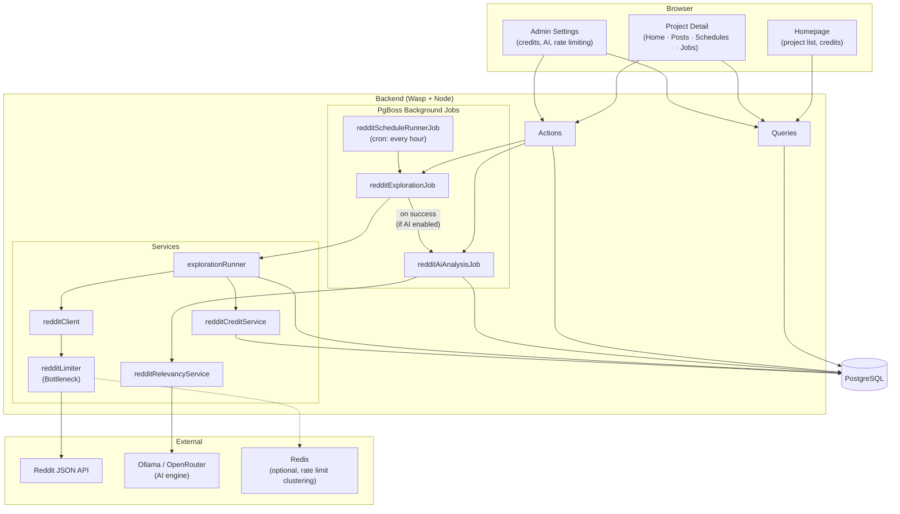

**How it fits together:**

- **Users** interact through three pages: homepage (project list), project detail (exploration, posts, schedules, jobs), and admin settings.
- **Actions** trigger background exploration jobs; the schedule runner also creates them on a cron.
- **Exploration** fetches posts from the Reddit JSON API (rate-limited via Bottleneck, optionally clustered with Redis), deducts credits, and upserts posts into the DB.
- **AI Analysis** runs after exploration (or on demand). Each post is evaluated by Ollama or OpenRouter; the result sets status, pain-point summary, and reasoning.
- **Credits** are deducted per Reddit API call. Admins top up balances.

---

## 2. Core concepts

| Concept | Description |
|---------|-------------|
| **Project** | A lead-gen campaign: name, product description, target subreddits, and keywords. Owns posts, jobs, schedules, and AI runs. |
| **Exploration** | A run that fetches posts from Reddit for the project's subreddits, filters by date range, and creates project posts with status `DOWNLOADED` (or `MATCH` if keywords hit). Deducts credits per API call. |
| **Strict keyword search** | Per-exploration/schedule toggle (default: on). When on, uses Reddit's search API with a multi-keyword OR query per subreddit. When off, fetches all subreddit `/new` posts and matches keywords locally. |
| **AI Relevancy** | Optional. When enabled, posts are queued for AI analysis after exploration. The AI evaluates relevance against the product description and generates a pain-point summary and reasoning for every post, regardless of relevance. Supports Ollama and OpenRouter engines, each with a "disable thinking" option. |
| **Job** | A single exploration run record. Tracks status, explored/matched counts, credits used, and error messages. |
| **Schedule** | Recurring exploration config (daily at a time, or cron). The schedule runner job fires hourly and submits exploration jobs for due schedules. |
| **AI Analysis Run** | A batch AI processing record. Tracks trigger source (manual or exploration), progress (`processedCount / totalToProcess`), and status. |
| **Reddit Credits** | Per-user balance consumed by Reddit API calls. Configurable cost per call. No auto-grant; admins top up manually. |

### Project ownership

Every project-scoped backend operation verifies that the caller is the **project owner** (`project.userId === context.user.id`) or an **admin** (`context.user.isAdmin`). Unauthorized access returns 403; missing project returns 404. Non-admin users only see their own projects in the list.

---

## 3. Status lifecycles

### 3.1 Post status (`RedditBotProjectPostStatus`)

Tracks where a post is in the lead qualification pipeline.

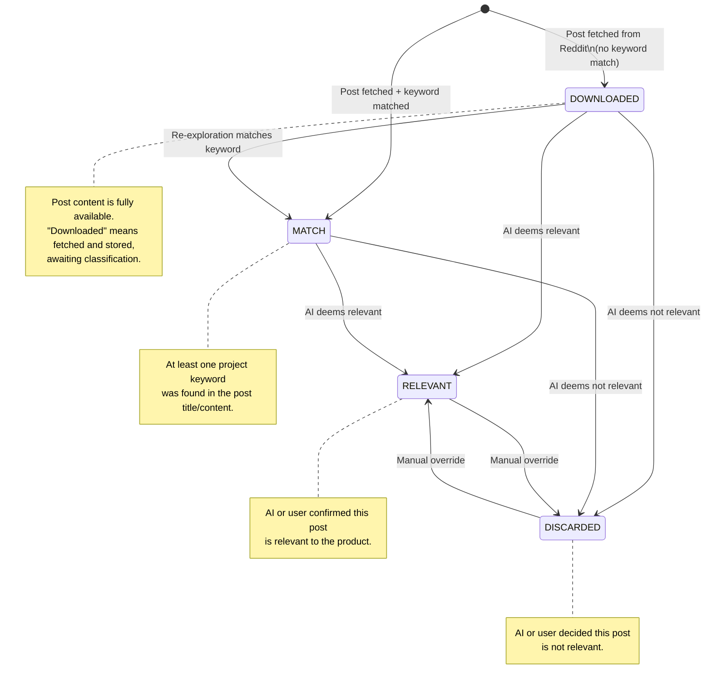

| Status | Meaning |
|--------|---------|
| `DOWNLOADED` | Fetched from Reddit, no keyword match. Fully stored (title, content, author, link). |
| `MATCH` | At least one project keyword found in the post during exploration. |
| `RELEVANT` | AI or user confirmed relevance to the product. |
| `DISCARDED` | AI or user decided the post is not relevant. |

### 3.2 AI analysis status (`RedditBotAiAnalysisStatus`)

Tracks the AI processing pipeline for each individual post.

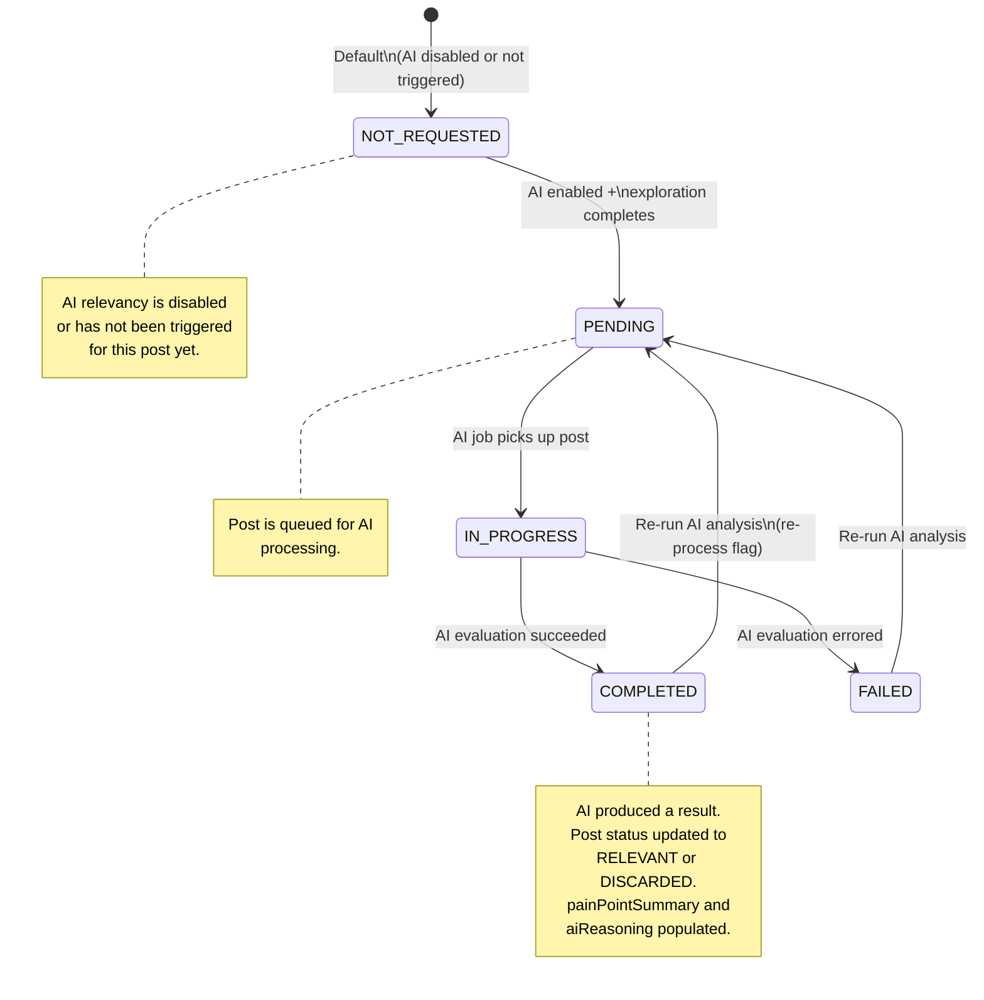

| Status | Meaning |
|--------|---------|
| `NOT_REQUESTED` | AI has not been triggered for this post. |
| `PENDING` | Queued for AI analysis. |
| `IN_PROGRESS` | Currently being processed by the AI job. |
| `COMPLETED` | AI evaluation finished; post status, pain-point summary, and reasoning are set. |
| `FAILED` | AI evaluation errored (e.g. model timeout, parse failure). Error stored in `aiAnalysisErrorMessage`. |

### 3.3 Job status (`RedditBotJobStatus`)

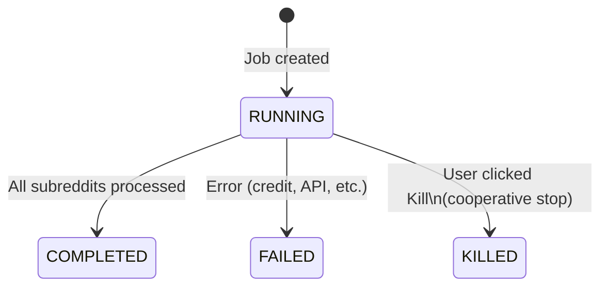

### 3.4 AI analysis run status (`RedditBotAiAnalysisRunStatus`)

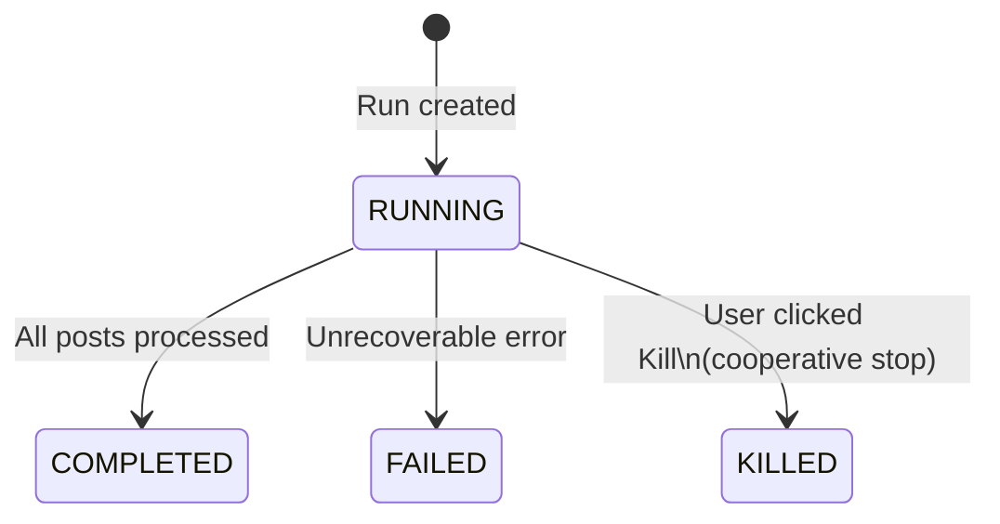

---

## 4. Data models

Full schema: [schema.prisma](../schema.prisma). Key-value settings keys: [redditSettingsKeys.ts](../src/server/reddit/redditSettingsKeys.ts).

### 4.1 Entity relationship diagram

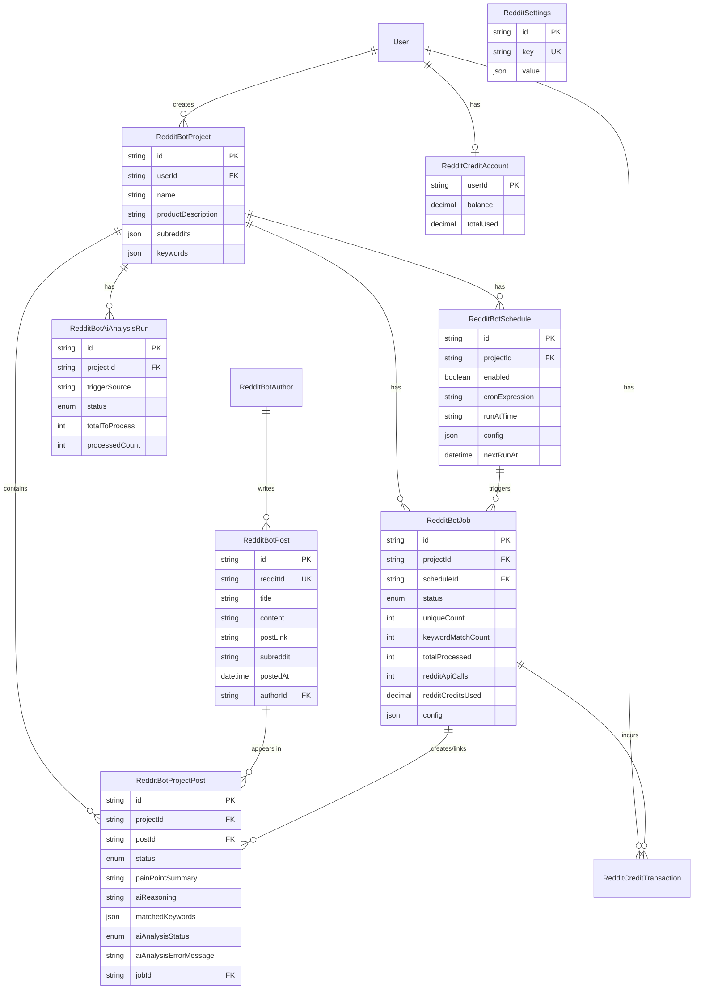

### 4.2 Model reference

| Model | Key fields |
|-------|------------|
| **RedditBotProject** | id, userId, name, description, productDescription, subreddits (Json), keywords (Json) |
| **RedditBotAuthor** | id, redditUsername (unique), profileUrl |
| **RedditBotPost** | id, redditId (unique), title, content, postLink, authorId, subreddit, postedAt |
| **RedditBotProjectPost** | projectId, postId, status, painPointSummary, aiReasoning, matchedKeywords (Json), aiAnalysisStatus, aiAnalysisErrorMessage, jobId |
| **RedditBotSchedule** | projectId, userId, enabled, cronExpression, runAtTime, config (Json), nextRunAt, lastRunAt |
| **RedditBotJob** | projectId, scheduleId?, status, uniqueCount, keywordMatchCount, totalProcessed, completedAt, errorMessage, config (Json), redditApiCalls, redditCreditsUsed |
| **RedditBotAiAnalysisRun** | id, projectId, triggerSource (`manual`/`exploration`), explorationJobId?, status, totalToProcess, processedCount, errorMessage, stopRequestedAt |
| **RedditSettings** | key (unique), value (Json) — key-value store for `credits.*`, `ai.*`, `bottleneck.*` |
| **RedditCreditAccount** | userId (unique), balance, totalUsed |
| **RedditCreditTransaction** | userId, amount (+top-up / -deduction), reason, jobId? |

### 4.3 Job log numbers

**Exploration job — "X matched, Y unique, Z total"**

- **matched** (`keywordMatchCount`): posts that matched at least one project keyword (status `MATCH`).
- **unique** (`uniqueCount`): distinct posts added to the project this run (new `RedditBotProjectPost` rows).
- **total** (`totalProcessed`): every post processing from the API. Same post can be processed more than once (crossposts, search overlap, pagination edge cases), so total >= unique.

**AI analysis run — "N / M"**

- **totalToProcess**: posts eligible when the run started (e.g. `PENDING` or `NOT_REQUESTED` AI status; for exploration-triggered runs, only posts from that job).
- **processedCount**: how many have been evaluated so far (`COMPLETED` or `FAILED`).

---

## 5. Backend API surface

Defined in [main.wasp](../main.wasp). Implementations split across [operations.ts](../src/reddit-bot/operations.ts) and [redditBotSettings.ts](../src/reddit-bot/redditBotSettings.ts).

### Queries

| Query | Source | Purpose |
|-------|--------|---------|
| `getRedditBotProjects` | operations | List user's projects (all for admin) |
| `getRedditBotProjectById` | operations | Single project with ownership check |
| `getRedditBotProjectPosts` | operations | Filtered, paginated post list |
| `getRedditBotProjectPostsForExport` | operations | Same filters, shaped for TSV export |
| `getRedditBotProjectPostFilterCounts` | operations | Counts per status, subreddit, keyword for filter badges |
| `getRedditBotSchedulesByProject` | operations | Project's schedules |
| `getRedditBotJobsByProject` | operations | Project's exploration jobs |
| `getRedditBotAiAnalysisRunsByProject` | operations | Project's AI analysis runs |
| `getRedditBotProjectCreditUsed` | operations | Total credits used by a project |
| `getRedditAiAnalysisProspectiveCount` | operations | Count of posts that would be analyzed (for dialog preview) |
| `getMyRedditCredit` | settings | Current user's balance + settings |
| `getRedditAiConfigStatus` | settings | Whether AI is enabled and configured |
| `getRedditSettings` | settings | Full admin settings (admin only) |
| `getRedditCreditUsersWithBalances` | settings | Users table with credit balances (admin) |
| `getRedditCreditAdminStats` | settings | Aggregate stats: API calls, issued, used (admin) |

### Actions

| Action | Source | Purpose |
|--------|--------|---------|
| `createRedditBotProject` | operations | Create a project |
| `updateRedditBotProject` | operations | Update project fields |
| `deleteRedditBotProject` | operations | Delete project + cascade |
| `updateRedditBotProjectPostStatus` | operations | Set post status + pain-point summary |
| `analyzeRedditBotProjectPost` | operations | Single-post AI analysis (sparkle button) |
| `markRedditBotProjectPostsAsExported` | operations | Stamp `lastExportedAt` |
| `createRedditBotSchedule` | operations | Create recurring schedule |
| `updateRedditBotSchedule` | operations | Edit schedule config/timing |
| `deleteRedditBotSchedule` | operations | Remove schedule |
| `runRedditBotExploration` | operations | Start exploration job |
| `killRedditBotJob` | operations | Cooperative kill on exploration job |
| `triggerRedditAiAnalysis` | operations | Start batch AI analysis run |
| `killRedditAiAnalysisRun` | operations | Cooperative kill on AI run |
| `updateRedditSettings` | settings | Save admin settings |
| `topUpRedditCredit` | settings | Add credits to a user |

### Background jobs (PgBoss)

| Job | Schedule | Handler |
|-----|----------|---------|
| `redditExplorationJob` | On demand | Fetches posts from Reddit, upserts into DB, then auto-submits AI analysis if enabled |
| `redditAiAnalysisJob` | On demand | Processes up to 100 posts per batch; evaluates each with Ollama/OpenRouter |
| `redditScheduleRunnerJob` | `cron: "0 * * * *"` | Finds due schedules, creates jobs, submits exploration |

### Routes

| Path | Page |
|------|------|
| `/reddit-bot` | Homepage (project list) |
| `/reddit-bot/project/:projectId` | Project detail (tabs) |
| `/admin/reddit-bot-settings` | Admin settings (admin only) |

---

## 6. Server services

Located in `src/server/reddit/`.

| Service | File | Responsibility |
|---------|------|----------------|
| **Exploration Runner** | `explorationRunner.ts` | Core loop: pages through Reddit API within a date range, upserts posts/authors, matches keywords, deducts credits, tracks counts, respects kill signals and max limits. |
| **Reddit Client** | `redditClient.ts` | Thin wrapper over Reddit's public JSON API (`/new.json`, `/search.json`). No OAuth. Uses `REDDIT_API_USER_AGENT` env var. |
| **Credit Service** | `redditCreditService.ts` | `getSettings()`, `getBalance()`, `deductCredit()`, `topUp()`, `getDecryptedOpenRouterApiKey()`. Reads all `RedditSettings` key-values into a typed object. |
| **Relevancy Service** | `redditRelevancyService.ts` | AI evaluation: calls Ollama (`ChatOllama` via LangChain) or OpenRouter (`openai` SDK) with a structured system prompt. Parses JSON response into `{ relevant, painPointSummary, reasoning }`. Caches client instances. Supports "disable thinking" per engine. |
| **Rate Limiter** | `redditLimiter.ts` | Bottleneck-based rate limiter. Supports in-memory or Redis-backed (ioredis) clustering. Config from `RedditSettings.bottleneck.*`. |
| **Settings Keys** | `redditSettingsKeys.ts` | Single source of truth for all setting key names and defaults (`credits.*`, `ai.*`, `bottleneck.*`). |
| **OpenRouter Key** | `redditOpenRouterKey.ts` | AES-256-GCM encrypt/decrypt for the OpenRouter API key at rest (via `REDDIT_OPENROUTER_KEY_ENCRYPTION_SECRET` env var). `maskKey()` for UI display. |

---

## 7. Frontend pages

### 7.1 Homepage (`/reddit-bot`)

- Project list cards: name, description, subreddit/keyword pills.
- "New Project" dialog: name, description, product description, subreddits, keywords.
- Delete project confirmation.
- Reddit credit balance display (balance + total used).
- Auto-refresh toggle (persisted to `localStorage`).

### 7.2 Project Detail (`/reddit-bot/project/:projectId`)

| Tab | Features |
|-----|----------|
| **Home** | Two-pane: project/product description (left), exploration controls (right). Subreddit + keyword checkboxes, date range presets + custom, max posts/leads limits, strict keyword search toggle. "Explore" button starts a job. "Schedule" opens the schedule creation dialog. Running-job status card. |
| **Posts** | Paginated table: Posted, Title, Author, Subreddit, Status (dropdown), Keywords (badge), AI status (sparkle button for single-post analysis), Fetched. Expandable rows show content + pain-point summary + AI reasoning. Filters: status, subreddit, keyword, date range. "Run AI Analysis" dialog with prospective count and re-run checkbox. "Export TSV" dialog (relevant-only or all, only-unexported toggle). Sortable. |
| **Schedules** | Schedule list: run time, next run, config summary, enabled toggle, edit/delete. Create-schedule dialog with same filter options as Home tab. |
| **Jobs** | Unified timeline of exploration jobs and AI analysis runs, sorted by date. Expandable details (subreddits, keywords, date range, credits, errors). Kill button for running entries. |

### 7.3 Admin Settings (`/admin/reddit-bot-settings`)

Three sections:

1. **Stats** — Total API calls, total credit issued, total credit used.
2. **Settings** — Credit defaults, AI engine config (Ollama/OpenRouter with disable-thinking toggles), Bottleneck rate limiting (with optional Redis clustering).
3. **Users & Credits** — User table with balances, per-user top-up button.

---

## 8. User flows

### 8.1 Exploration flow

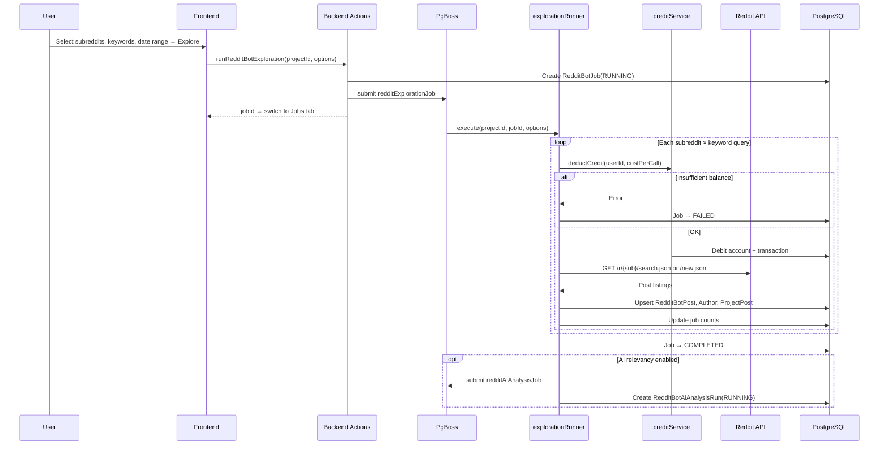

### 8.2 AI analysis flow

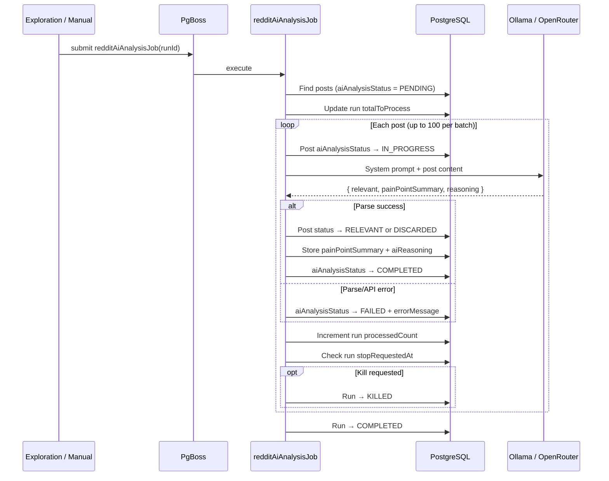

**AI prompt behavior:** The system prompt instructs the AI to always produce three fields:
- `relevant` (boolean) — whether the post is relevant to the product.
- `painPointSummary` — the user's intent or problem, generated for all posts regardless of relevance.
- `reasoning` — why the AI decided the post is relevant or not, generated for all posts.

### 8.3 Schedule flow

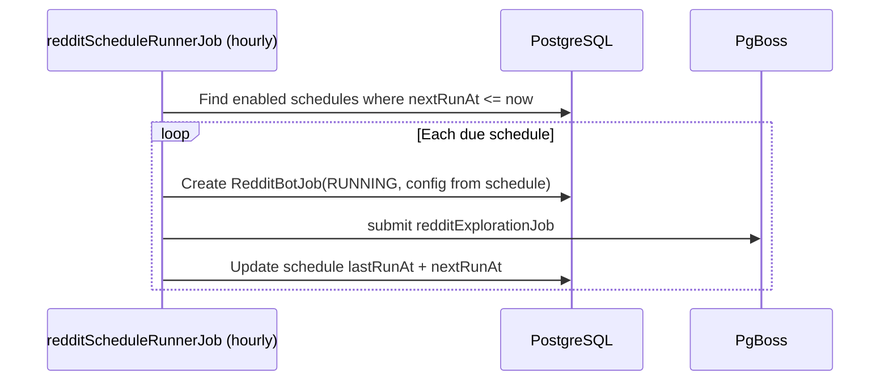

### 8.4 Post management flow

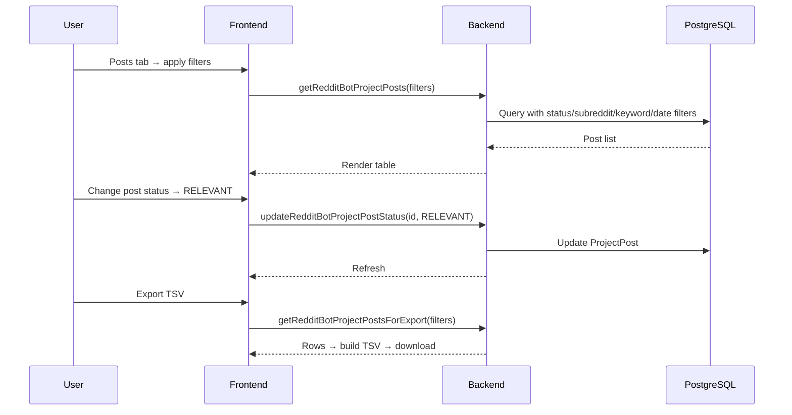

### 8.5 Credit flow

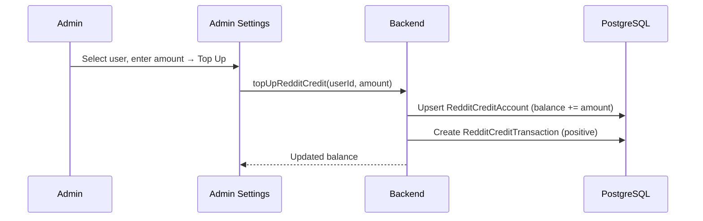

Credit is deducted during exploration (see 8.1). Each Reddit API call costs `credits.perApiCall` (configurable). Insufficient balance fails the exploration job.

---

## 9. Admin settings

Settings are stored as key-value pairs in `RedditSettings`. Full key list in [redditSettingsKeys.ts](../src/server/reddit/redditSettingsKeys.ts).

| Category | Keys | Defaults |
|----------|------|----------|
| **Credits** | `credits.defaultForNewUser`, `credits.perApiCall` | 100, 1 |
| **AI** | `ai.enabled`, `ai.engine` | false, `"ollama"` |
| **AI — Ollama** | `ai.ollama.baseUrl`, `ai.ollama.model`, `ai.ollama.disableThinking` | `http://localhost:11434`, `""`, true |
| **AI — OpenRouter** | `ai.openrouter.baseUrl`, `ai.openrouter.model`, `ai.openrouter.apiKey`, `ai.openrouter.disableThinking` | `https://openrouter.ai/api/v1`, `""`, `""`, true |
| **Bottleneck** | `bottleneck.minTime`, `bottleneck.maxConcurrent`, `bottleneck.reservoir`, `bottleneck.reservoirRefreshInterval` | 1000, 1, null, null |
| **Bottleneck — Redis** | `bottleneck.redis.clusteringEnabled`, `bottleneck.redis.host`, `bottleneck.redis.port` | false, `"localhost"`, 6379 |

**AI engine options:**
- **Ollama** — Local LLM via LangChain's `ChatOllama`. The `disableThinking` toggle controls the `think` parameter (when disabled, `think: false` is sent to suppress reasoning tokens).
- **OpenRouter** — Cloud LLM via the `openai` SDK pointed at OpenRouter's API. The `disableThinking` toggle adds `reasoning: { effort: 'none' }` to suppress extended thinking. API key is encrypted at rest when `REDDIT_OPENROUTER_KEY_ENCRYPTION_SECRET` is set.

**Rate limiting:** All Reddit API requests go through Bottleneck. When Redis clustering is enabled, rate limits are shared across processes/instances.

---

## 10. Troubleshooting

### Reddit API 403 Blocked

Reddit requires a unique, descriptive User-Agent. Missing or generic values are blocked with 403.

**Fix:** Set the `REDDIT_API_USER_AGENT` environment variable:

```
REDDIT_API_USER_AGENT="platform:app_id:version (by /u/YourRedditUsername)"
```

Example: `server:toolkit-leadgen:1.0 (by /u/yourname)`. See [redditClient.ts](../src/server/reddit/redditClient.ts).

### AI analysis produces empty results

- Verify the AI engine is enabled and configured in admin settings.
- For Ollama: ensure the service is running and the model is pulled.
- For OpenRouter: verify the API key is valid and the model name matches OpenRouter's catalog.
- Check `aiAnalysisErrorMessage` on failed posts for specific error details.

### Credits run out mid-exploration

The job fails with an "Insufficient credit" error. Top up the user's balance in admin settings and re-run the exploration.

### Stale server after code changes

If code changes aren't reflected, run `wasp clean && wasp compile` then restart `wasp start` to ensure the server bundle is rebuilt from scratch.
